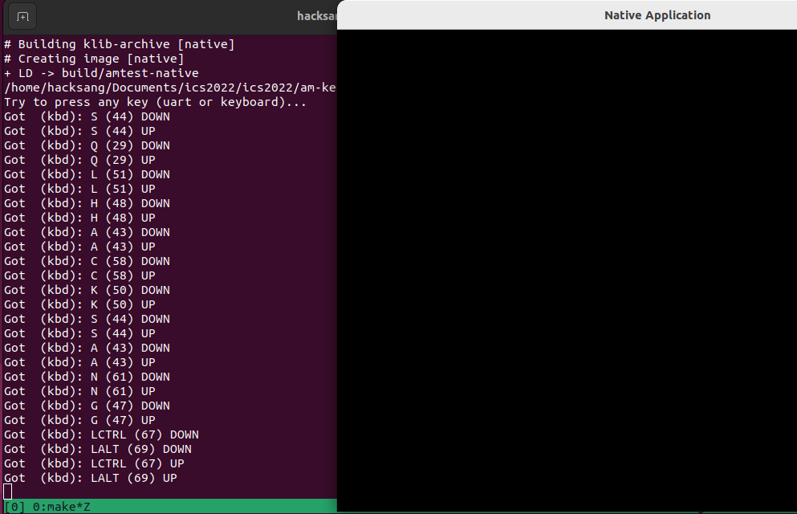
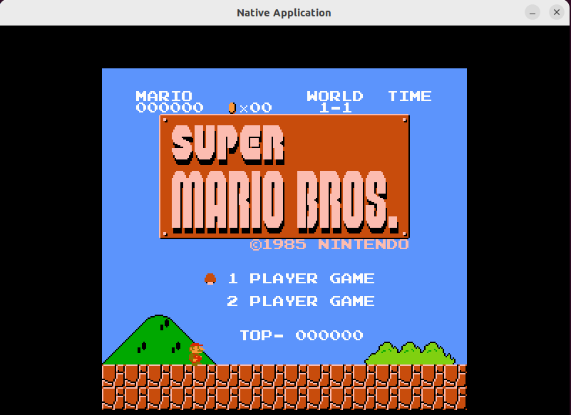
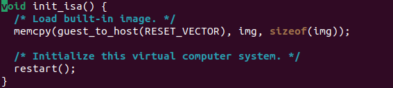
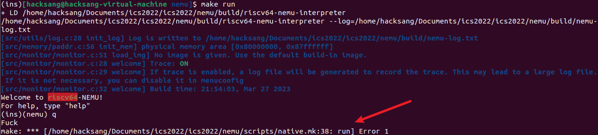
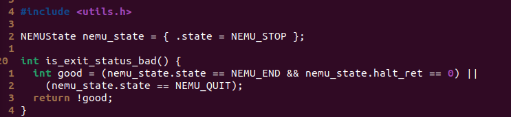
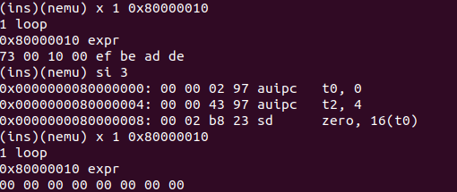

[TOC]


# PA1 Simplest Machine

## Before the travel

### 检查画面，按键和声音

* 声音

  虚拟机的声音需要在Vmware works的settings中选中声卡和已连接选项。

* 按键

  克隆一个新的子项目`am-kernels`, 里面包含了一些测试程序:

  ```bash
  cd ics2022
  bash init.sh am-kernels
  ```

  然后运行其中的按键测试程序:

  ```bash
  cd am-kernels/tests/am-tests
  make ARCH=native mainargs=k run
  ```

  运行后会弹出一个新窗口, 在新窗口中按下按键, 你将会看到程序在终端输出相应的按键信息, 包括按键名, 键盘码, 以及按键状态. 

  

* 画面

  玩一下超级玛丽，ROM[链接](http://jyywiki.cn/ICS/2021/labs/PA1)，根据fceux中的README.md运行

  

### 使用ccache

```shell
sudo apt install ccache
```

将下面内容写入bashrc

```shell
export PATH=/usr/lib/ccache:$PATH
```

### 选择ISA

> ISA的本质就是类似这样的规范. 所以ISA的存在形式既不是硬件电路, 也不是软件代码, 而是一本规范手册.

选择riscv64，通过make menuconfig进行更改。

## 开天辟地的篇章

### 程序是个状态机

> 计算机是个状态机
>
> 既然计算机是一个数组逻辑电路, 那么我们可以把计算机划分成两部分, 一部分由所有时序逻辑部件(存储器, 计数器, 寄存器)构成, 另一部分则是剩余的组合逻辑部件(如加法器等). 这样以后, 我们就可以从状态机模型的视角来理解计算机的工作过程了: 在每个时钟周期到来的时候, 计算机根据当前时序逻辑部件的状态, 在组合逻辑部件的作用下, 计算出并转移到下一时钟周期的新状态.

程序是状态机的一个子集。

我们其实可以从两个互补的视角来看待同一个程序:

- 一个是以代码(或指令序列)为表现形式的静态视角, 大家经常说的"写程序"/"看代码", 其实说的都是这个静态视角. 这个视角的一个好处是描述精简, 分支, 循环和函数调用的组合使得我们可以通过少量代码实现出很复杂的功能. 但这也可能会使得我们对程序行为的理解造成困难.
- 另一个是以状态机的状态转移为运行效果的动态视角, 它直接刻画了"程序在计算机上运行"的本质. 但这一视角的状态数量非常巨大, 程序代码中的所有循环和函数调用都以指令的粒度被完全展开, 使得我们难以掌握程序的整体语义. 但对于程序的局部行为, 尤其是从静态视角来看难以理解的行为, 状态机视角可以让我们清楚地了解相应的细节.

## RTFSC

### 配置系统和项目构建

在真正开始阅读代码之前, 我们先来简单介绍一下NEMU项目中的配置系统和项目构建.

#### 配置系统kconfig

在一个有一定规模的项目中, 可配置选项的数量可能会非常多, 而且配置选项之间可能会存在关联, 比如打开配置选项A之后, 配置选项B就必须是某个值. 直接让开发者去管理这些配置选项是很容易出错的, 比如修改选项A之后, 可能会忘记修改和选项A有关联的选项B. 配置系统的出现则是为了解决这个问题.

NEMU中的配置系统位于`nemu/tools/kconfig`, 它来源于GNU/Linux项目中的kconfig, 我们进行了少量简化. kconfig定义了一套简单的语言, 开发者可以使用这套语言来编写"配置描述文件". 在"配置描述文件"中, 开发者可以描述:

- 配置选项的属性, 包括类型, 默认值等
- 不同配置选项之间的关系
- 配置选项的层次关系

在NEMU项目中, "配置描述文件"的文件名都为`Kconfig`, 如`nemu/Kconfig`. 当你键入`make menuconfig`的时候, 背后其实发生了如下事件:

- 检查`nemu/tools/kconfig/build/mconf`程序是否存在, 若不存在, 则编译并生成`mconf`

- 检查`nemu/tools/kconfig/build/conf`程序是否存在, 若不存在, 则编译并生成`conf`

- 运行命令`mconf nemu/Kconfig`, 此时`mconf`将会解析`nemu/Kconfig`中的描述, 以菜单树的形式展示各种配置选项, 供开发者进行选择

- 退出菜单时, `mconf`会把开发者选择的结果记录到`nemu/.config`文件中

- 运行命令

  ```
  conf --syncconfig nemu/Kconfig
  ```

  , 此时

  ```
  conf
  ```

  将会解析

  ```
  nemu/Kconfig
  ```

  中的描述, 并读取选择结果

  ```
  nemu/.config
  ```

  , 结合两者来生成如下文件:

  - 可以被包含到C代码中的宏定义(`nemu/include/generated/autoconf.h`), 这些宏的名称都是形如`CONFIG_xxx`的形式
  - 可以被包含到Makefile中的变量定义(`nemu/include/config/auto.conf`)
  - 可以被包含到Makefile中的, 和"配置描述文件"相关的依赖规则(`nemu/include/config/auto.conf.cmd`), 为了阅读代码, 我们可以不必关心它
  - 通过时间戳来维护配置选项变化的目录树`nemu/include/config/`, 它会配合另一个工具`nemu/tools/fixdep`来使用, 用于在更新配置选项后节省不必要的文件编译, 为了阅读代码, 我们可以不必关心它

所以, 目前我们只需要关心配置系统生成的如下文件:

- `nemu/include/generated/autoconf.h`, 阅读C代码时使用
- `nemu/include/config/auto.conf`, 阅读Makefile时使用

#### 项目构建和Makefiles

关于Makefile中$@和$<

```
all: library.cpp main.cpp
```

In this case:

- `$@` evaluates to `all`
- `$<` evaluates to `library.cpp`
- `$^` evaluates to `library.cpp main.cpp`

### ctags

```shell
ctags -R *
```

| Keyboard command  | Action                                         |
| ----------------- | ---------------------------------------------- |
| `Ctrl-]`          | Jump to the tag underneath the cursor          |
| `:ts <tag> <RET>` | Search for a particular tag                    |
| `:tn`             | Go to the next definition for the last tag     |
| `:tp`             | Go to the previous definition for the last tag |
| `:ts`             | List all of the definitions of the last tag    |
| `Ctrl-t`          | Jump back up in the tag stack                  |

使用ctags中遇到了怎么也没办法解析函数名的问题，后来发现在根目录生成tags文件后，需要在根目录进行vim，在子目录vim是没办法解析到的。

## The structure of code

* FCEUX: 红白机模拟项目
* NEMU：模拟器
  * monitor：不属于计算机的必要组成部分，引入方便调试。
  * CPU
    * cpu-exec.c：程序执行的主循环
  * memory
  * device
  * engine
    * interpreter：解释器的实现
* abstract-machine：抽象计算机
* am-kernels：基于抽象计算机开发的应用程序

为了支持不同的ISA, 框架代码把NEMU分成两部分: ISA无关的基本框架和ISA相关的具体实现. NEMU把ISA相关的代码专门放在`nemu/src/isa/`目录下, 并通过`nemu/include/isa.h`提供ISA相关API的声明. 这样以后, `nemu/src/isa/`之外的其它代码就展示了NEMU的基本框架. 这样做有两点好处:

- 有助于我们认识不同ISA的共同点: 无论是哪种ISA的客户计算机, **它们都具有相同的基本框架**
- 体现抽象的思想: 框架代码将ISA之间的差异抽象成API, 基本框架会调用这些API, 从而无需关心ISA的具体细节. 如果你将来打算选择一个不同的ISA来进行二周目的攻略, 你就能明显体会到抽象的好处了: 基本框架的代码完全不用修改!

API参照网站：[这个页面](https://ysyx.oscc.cc/docs/ics-pa/nemu-isa-api.html)

主程序逻辑如下：

1. am_init_monitor or init_monitor:

   1. parse_args

   2. **init_rand**

   3. init_log

   4. **init_mem**

   5. **init_devices**

   6. **init_isa**

      

      1. 将客户程序读入内存

      2. 初始化寄存器PC和gpr

          初始化寄存器的一个重要工作就是设置`cpu.pc`的初值, 我们需要将它设置成刚才加载客户程序的内存位置, 这样就可以让CPU从我们约定的内存位置开始执行客户程序了. 对于mips32和riscv32, 它们的0号寄存器总是存放`0`, 因此我们也需要对其进行初始化.

   7. **load_img**

   8. init_difftest

   9. init_sdb

2. engine_start

   1. cpu_exec
   2. sdb_mainloop

在真实的计算机系统中, 计算机启动后首先会把控制权交给BIOS, BIOS经过一系列初始化工作之后, 再从磁盘中将有意义的程序读入内存中执行. 对这个过程的模拟需要了解很多超出本课程范围的细节, 我们在PA中做了简化: 采取约定的方式让CPU直接从约定的内存位置开始执行.

### debug about error when typing q to exit

当键入q直接退出时，会出现Error，但如果输入c，再输入q则不会出现错误。



1. make run -n查看可运行文件名字

2. 通过cgdb运行该文件

3. 通过调试，发现如果运行c命令，会运行默认的指令，由于默认指令有ebreak，ebreak被定义为set_nemu_state，将nemu_state.state设置为NEMU_END（2），从而在运行q时，执行is_exit_status_bad中good为1，返回值为0，并不会报错

   

   而直接运行q，由于并没有设置系统状态为NEMU_QUIT，所以good为0，返回值为1，导致Makefile文件中产生错误。

## 基础设施

* 打印内存，通过printf和运行程序验证正确性（a little weak）

  需要包含<memory/paddr.h>

  

## 表达式求值

> 在TRM中, 寄存器(包括PC)和内存中的值唯一地确定了计算机的一个状态

因此打印寄存器和扫描内存这两个功能一定可以帮助我们调试。

这里面有些用到了编译原理的内容

1. 词法分析

   识别token，本次实验中选择了一条简单的方法：通过正则表达式来识别。

2. 递归求值

   递归求值中的起始位置应当为数组下标，否则前面得到的tokens变量将毫无意义。

   找主token时需要考虑(1+2)*(3+4)的情况，考虑有括号的运算符不能是主token，思路在layer为0的层级找token。

### 测试代码

测试程序通常会遇到以下两种情况，导致无法算出表达式结果。

1. 错误：编译错误，出现多余空格
2. 警告：除0警告，仍可以运行。

于是在测试我们的expr函数时，遇到这两种情况，将全局变量eval_success设置为false，进行判断。

* 除0

  除0确实不好解决，如果不进行求值，很难找到1/(1-1)这种。

  生成input文件时，发现有些除0错误会在编译期间被gcc优化掉，导致生成正常结果，但自己的计算机会报错，从而导致测试样例不通过的场景。具体代码如下：

  ```c
  #include <stdio.h>
  int main() { 
    int result = 3/10*(7/0);
    printf("%d\n", result);
    return 0; 
  }
  ```

  后面通过生成数字时剔除了0来先通过测试。

* 无符号

  使用uint64_t，需要加入<stdint.h>头文件，否则会报错误。同样，针对64位代码，应采用uint64_t的结果，需要注意printf、scanf、atoi以及运算变量不能设置无符号整数等的设置。

* 正负数和不同进制

  不同进制和十进制通过正则一起识别，最后求值时从字符串转整数通过strtol传入不同参数获取。

* 解引用

  想不清楚解引用前一个token是什么类型可以和乘号区分开，因此简单实现。

## 监视点

* cpu_exec
  * execute
    * exec_once
    * trace_and_difftest：其中扫描所有的监视点

增加宏定义后需要重新`make menuconfig`写入config文件

## 调试工具与原理

首先，机器永远都是对的。

* Fault: 实现错误的代码，例如`if (p = NULL)`
* Error: 程序执行时不符合预期的状态，例如p被错误地赋值为`NULL`
* Failure: 能直接观测到的错误，例如程序触发了段错误。

调试其实就是从观测到的failure一步一步回溯寻找fault的过程, 找到了fault之后, 我们就很快知道应该如何修改错误的代码了. 但从上面的例子也可以看出, 调试之所以不容易, 恰恰是因为:

- fault不一定马上触发error
- 触发了error也不一定马上转变成可观测的failure
- error会像滚雪球一般越积越多, 当我们观测到failure的时候, 其实已经距离fault非常遥远了

因此我们需要尽可能早的实现Fault->Error->Failure的转换

* Fault->error

  全面测试代码

* Error->Failure

  * -Wall, -Werror
  * assert，把运行时刻的error直接转变成failure
  * printf
  * GDB

根据上面的分析, 我们就可以总结出一些调试的建议:

- 总是使用`-Wall`和`-Werror`
- 尽可能多地在代码中插入`assert()`
- 调试时先启用sanitizer
- `assert()`无法捕捉到error时, 通过`printf()`输出可疑的变量, 期望能观测到error
- `printf()`不易观测error时, 通过GDB理解程序的精确行为


统计.c和.h的行数

```shell
find . -name "*.[ch]" | xargs wc -l
```

统计.c和.h中除了空行的行数

```shell
find . -name "*.[ch]" | xargs cat | grep -v ^$ | wc -l
```

## 扩展阅读-debugger中断点的实现

[这篇文章](https://eli.thegreenplace.net/2011/01/27/how-debuggers-work-part-2-breakpoints)

### Setting breakpoints in the debugger with int 3

To set a breakpoint at some target address in the traced process, the debugger does the following:

1. Remember the data stored at the target address
2. Replace the first byte at the target address with the int 3 instruction

Then, when the debugger asks the OS to run the process (with `PTRACE_CONT` as we saw in the previous article), the process will run and eventually hit upon the `int 3`, where it will stop and the OS will send it a signal. This is where the debugger comes in again, receiving a signal that its child (or traced process) was stopped. It can then:

1. Replace the int 3 instruction at the target address with the original instruction
2. Roll the instruction pointer of the traced process back by one. This is needed because the instruction pointer now points *after* the `int 3`, having already executed it.
3. Allow the user to interact with the process in some way, since the process is still halted at the desired target address. This is the part where your debugger lets you peek at variable values, the call stack and so on.
4. When the user wants to keep running, the debugger will take care of placing the breakpoint back (since it was removed in step 1) at the target address, unless the user asked to cancel the breakpoint.

