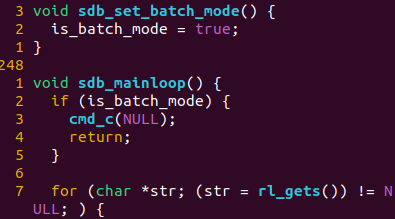
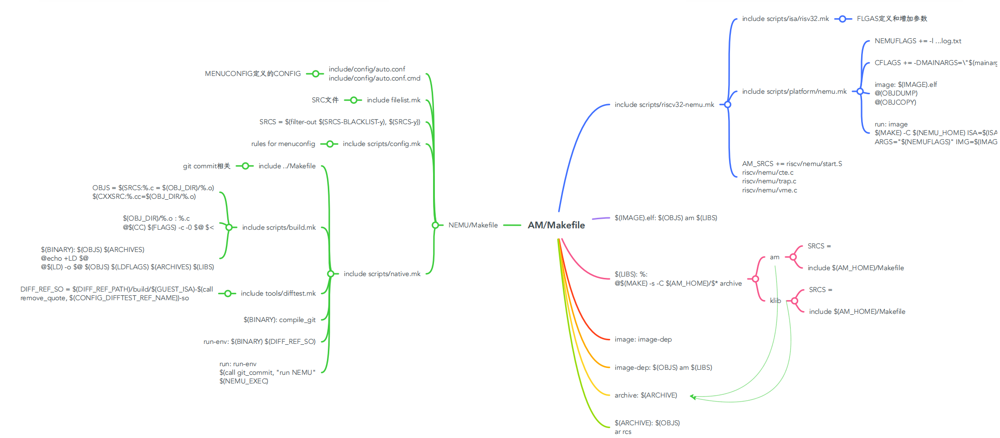

[TOC]

# PA2  Von Neumann machine

## 不停计算机的机器

PA1只是编程复习的热身，PA2是正片的开始，需要不断读讲义，RTFM、RTFSC并整理其中的细节。

* 取指
* 译码
* 执行
* 更新PC

## RTFM

读了RISC-V Manual的Introduction和RV32I章节。——2023/05/02

## RTFSC

```c
engine_start->cpu_exec(-1)->execute(n)->for(){
    exec_once->isa_exec_once->inst_fetch & decode_exec
    g_nr_guest_inst++;
    trace_and_difftest();
    if (nemu_state.state != NEMU_RUNNING) break;
}
```

具体地, `exec_once()`接受一个`Decode`类型的结构体指针`s`, 这个结构体用于存放在执行一条指令过程中所需的信息, 包括指令的PC, 下一条指令的PC等。


`exec_once()`函数覆盖了指令周期的所有阶段: 取指, 译码, 执行, 更新PC, 接下来我们来看看NEMU是如何实现指令周期的每一个阶段的.

我们之前提到了`snpc`和`dnpc`, 现在来说明一下它们的区别.

在程序分析领域中, 静态指令是指程序代码中的指令, 动态指令是指程序运行过程中的指令. 例如对于以下指令序列

```
100: jmp 102
101: add
102: xor
```

`jmp`指令的下一条静态指令是`add`指令, 而下一条动态指令则是`xor`指令.

有了静态指令和动态指令这两个概念之后, 我们就可以说明`snpc`和`dnpc`的区别了: `snpc`是下一条静态指令, 而`dnpc`是下一条动态指令. 对于顺序执行的指令, 它们的`snpc`和`dnpc`是一样的; 但对于跳转指令, `snpc`和`dnpc`就会有所不同, `dnpc`应该指向跳转目标的指令. 显然, 我们应该使用`s->dnpc`来更新PC, 并且在指令执行的过程中正确地维护`s->dnpc`.

### IF

inst_fetch函数：取指令，更新snpc

### ID

decode_exec函数

NEMU使用一种抽象层次更高的译码方式: 模式匹配, NEMU可以通过一个模式字符串来指定指令中`opcode`

其中`INSTPAT`(意思是instruction pattern)是一个宏(在`nemu/include/cpu/decode.h`中定义), 它用于定义一条模式匹配规则. 其格式如下:

```
INSTPAT(模式字符串, 指令名称, 指令类型, 指令执行操作);
```

`模式字符串`中只允许出现4种字符:

- `0`表示相应的位只能匹配`0`
- `1`表示相应的位只能匹配`1`
- `?`表示相应的位可以匹配`0`或`1`
- 空格是分隔符, 只用于提升模式字符串的可读性, 不参与匹配

`指令名称`在代码中仅当注释使用, 不参与宏展开; `指令类型`用于后续译码过程; 而`指令执行操作`则是通过C代码来模拟指令执行的真正行为.

### 运行第一个C程序

在`am-kernels/tests/cpu-tests/`目录下键入

```bash
make ARCH=$ISA-nemu ALL=dummy run
```

编译`dummy`程序, 并启动NEMU运行它.

事实上, 并不是每一个程序都可以在NEMU中运行, `abstract-machine`子项目专门用于编译出能在NEMU中运行的程序

SLTU将无符号引入解码还是执行？本身word_t是uint类型，需要注意。

## 程序，运行时环境和AM

### 运行时环境

一个事实是, 应用程序的运行都需要[运行时环境](http://en.wikipedia.org/wiki/Runtime_system)的支持, 包括加载, 销毁程序, 以及提供程序运行时的各种动态链接库(你经常使用的库函数就是运行时环境提供的)等。

> This environment may address a number of issues including the [management](https://en.wikipedia.org/wiki/Memory_management) of application [memory](https://en.wikipedia.org/wiki/Computer_memory), how the program accesses [variables](https://en.wikipedia.org/wiki/Variable_(computer_science)), mechanisms for passing parameters between [procedures](https://en.wikipedia.org/wiki/Subroutine), interfacing with the [operating system](https://en.wikipedia.org/wiki/Operating_system), and otherwise.

只要有内存, 有结束运行的方式, 加上实现正确的指令, 就可以支撑最简单程序的运行了. 而这, 也可以算是最简单的运行时环境了。

### 将运行时环境封装为库函数

通过库, 运行程序所需要的公共要素被抽象成API, 不同的架构只需要实现这些API, 也就相当于实现了支撑程序运行的运行时环境, 这提升了程序开发的效率。

### AM-裸机（Bare-mental）运行时环境

统一抽象的API代表了程序运行对计算机的需求, 所以我们把这组API称为抽象计算机. AM(Abstract machine)项目就是这样诞生的. 作为一个向程序提供运行时环境的库, AM根据程序的需求把库划分成以下模块

```
AM = TRM + IOE + CTE + VME + MPE
```

- TRM(Turing Machine) - 图灵机, 最简单的运行时环境, 为程序提供基本的计算能力
- IOE(I/O Extension) - 输入输出扩展, 为程序提供输出输入的能力
- CTE(Context Extension) - 上下文扩展, 为程序提供上下文管理的能力
- VME(Virtual Memory Extension) - 虚存扩展, 为程序提供虚存管理的能力
- MPE(Multi-Processor Extension) - 多处理器扩展, 为程序提供多处理器通信的能力 (MPE超出了ICS课程的范围, 在PA中不会涉及)

AM给我们展示了程序与计算机的关系: 利用计算机硬件的功能实现AM, 为程序的运行提供它们所需要的运行时环境. 感谢AM项目的诞生, 让NEMU和程序的界线更加泾渭分明, 同时使得PA的流程更加明确:

```
(在NEMU中)实现硬件功能 -> (在AM中)提供运行时环境 -> (在APP层)运行程序
(在NEMU中)实现更强大的硬件功能 -> (在AM中)提供更丰富的运行时环境 -> (在APP层)运行更复杂的程序
```

**volatile**表示编译器不要优化代码,后面的指令保留原样。

`am-kernels`子项目用于收录一些可以在AM上运行的测试集和简单程序

需要说明的是, 我们不能使用gcc的默认选项直接编译, 因为默认选项会根据GNU/Linux的运行时环境将代码编译成运行在GNU/Linux下的可执行文件. 但此时的NEMU并不能为客户程序提供GNU/Linux的运行时环境, 在NEMU中无法正确运行上述可执行文件, 因此我们不能使用gcc的默认选项来编译用户程序.

解决这个问题的方法是[交叉编译](http://en.wikipedia.org/wiki/Cross_compiler). 我们需要在GNU/Linux下根据AM的运行时环境编译出能够在`$ISA-nemu`这个新环境中运行的可执行文件. 为了不让链接器ld使用默认的方式链接, 我们还需要提供描述`$ISA-nemu`的运行时环境的链接脚本. AM的框架代码已经把相应的配置准备好了, 上述编译和链接选项主要位于`abstract-machine/Makefile` 以及`abstract-machine/scripts/`目录下的相关`.mk`文件中. 编译生成一个可以在NEMU的运行时环境上运行的程序的过程大致如下:

- gcc将`$ISA-nemu`的AM实现源文件编译成目标文件, 然后通过ar将这些目标文件作为一个库, 打包成一个归档文件`abstract-machine/am/build/am-$ISA-nemu.a`
- gcc把应用程序源文件(如`am-kernels/tests/cpu-tests/tests/dummy.c`)编译成目标文件
- 通过gcc和ar把程序依赖的运行库(如`abstract-machine/klib/`)也编译并打包成归档文件
- 根据Makefile文件`abstract-machine/scripts/$ISA-nemu.mk`中的指示, 让ld根据链接脚本`abstract-machine/scripts/linker.ld`, 将上述目标文件和归档文件链接成可执行文件

根据上述链接脚本的指示, 可执行程序重定位后的节从`0x100000`或`0x80000000`开始 (取决于`_pmem_start`和`_entry_offset`的值), 首先是`.text`节, 其中又以`abstract-machine/am/src/$ISA/nemu/start.S`中自定义的`entry`节开始, 然后接下来是其它目标文件的`.text`节. 这样, 可执行程序起始处总是放置`start.S`的代码, 而不是其它代码, 保证客户程序总能从`start.S`开始正确执行

我们对编译得到的可执行文件的行为进行简单的梳理:

1. 第一条指令从`abstract-machine/am/src/$ISA/nemu/start.S`开始, 设置好栈顶之后就跳转到`abstract-machine/am/src/platform/nemu/trm.c`的`_trm_init()`函数处执行.
2. 在`_trm_init()`中调用`main()`函数执行程序的主体功能, `main()`函数还带一个参数, 目前我们暂时不会用到, 后面我们再介绍它.
3. 从`main()`函数返回后, 调用`halt()`结束运行.

有了TRM这个简单的运行时环境, 我们就可以很容易地在上面运行各种"简单"的程序了

### 阅读Makefile

当在am-kernels/tests/cpu-tests文件夹下make运行测试程序时，makefile“调用”关系如下：

1. 为每一个测试程序创建Makefile.xxx，其中包含{AM_HOME}/Makefile，进入am文件夹下的Makefile

2. am Makefile进行编译和链接运行时环境库的操作，其中包含ARCH.mk

   

3. 在scrips/riscv32-nemu.mk中包含了如下mk

   

4. 在platform/nemu.mk中存在run标识的命令，其中会做一些反汇编操作，然后执行NEMU目录下的makefile

5. nemu/Makefile中包含native.mk

   

6. 该native.mk包含了run的标识，调用nemu文件，我们只需要在执行文件的flags加上-b即可。使用``NEMUFLAGS``变量即可，于是在am的Makefile中添加```NEMUFLAGS += -b```即可

加上b选项，会设置is_batch_mode变量为true，在sdb_mainloop中会自动调用cmd_c函数执行命令。



## 基础设施

* 指令执行的踪迹：itrace

* 指令环形缓冲区：iringbuf（需实现）

  一般来说, **我们只会关心出错现场前的trace**, 在运行一些大程序的时候, 运行前期的trace大多时候没有查看甚至输出的必要. 一个很自然的想法就是, 我们能不能在客户程序出错(例如访问物理内存越界)的时候输出最近执行的若干条指令呢?

  要实现这个功能其实并不困难, 我们只需要维护一个很简单的数据结构 - 环形缓冲区(ring buffer)即可.

* 内存访问的踪迹：mtrace

* 函数调用的踪迹：ftrace

  jal：函数调用。通过rd来判断是调用还是无条件跳转，rd为0表示无条件跳转，rd为其他表示函数调用。

  jalr：函数返回。jalr目标寄存器为ra(0x01)表示函数返回，为其他表示函数调用。

f0直接返回到f2的原因在于f0、f1都是jr命令执行函数调用，并没有将返回地址放入rd中，f2和f3中的函数调用都是jalr调用。

### AM作为基础设施

`abstract-machine`中有一个特殊的架构叫`native`, 是用GNU/Linux默认的运行时环境来实现的AM API. 例如我们通过`gcc hello.c`编译程序时, 就会编译到GNU/Linux提供的运行时环境; 你在PA1试玩的超级玛丽, 也是编译到`native`上并运行. 和`$ISA-nemu`相比, `native`有如下好处:

- 直接运行在真机上, 可以相信真机的行为永远是对的
- 就算软件有bug, 在`native`上调试也比较方便(例如可以使用GDB, 比NEMU的monitor方便很多)

因此, 与其在`$ISA-nemu`中直接调试软件, 还不如在`native`上把软件调对, 然后再换到`$ISA-nemu`中运行, 来对NEMU进行测试. 在`abstract-machine`中, 我们可以很容易地把程序编译到另一个架构上运行, 例如在`am-kernels/tests/cpu-tests/`目录下执行

```bash
make ALL=string ARCH=native run
```

即可将`string`程序编译到`native`并运行. 

框架代码编译到`native`的时候默认链接到glibc, 我们需要把这些库函数的调用链接到我们编写的klib来进行测试. 我们可以通过在`abstract-machine/klib/include/klib.h` 中通过定义宏`__NATIVE_USE_KLIB__`来把库函数链接到klib. 如果不定义这个宏, 库函数将会链接到glibc, 可以作为正确的参考实现来进行对比.

这是因为在klib/src/string.c存在如下宏判断，如果未定义```__NATIVE_USE_KLIB__```，链接器找不到符号的定义，就会去/usr/lib下面找glibc的函数实现。


### Difftest

完善的基础设施使得CPU设计变得高效简单, 甚至完成了前人无法完成的任务. 有了基础设施, 令人望而却步的处理器硬件设计也可以脱胎换骨, 浴火重生

difftest_step

* check_regs
  * isa_difftest_checkregs
    * riscv32具体实现

## 输入输出

设备也有自己的状态寄存器(相当于CPU的寄存器), 也有自己的功能部件(相当于CPU的运算器). 当然不同的设备有不同的功能部件, 例如键盘有一个把按键的模拟信号转换成扫描码的部件, 而VGA则有一个把像素颜色信息转换成显示器模拟信号的部件

常用的编址方式有两种.

### 端口I/O

一种I/O编址方式是端口映射I/O(port-mapped I/O), CPU使用专门的I/O指令对设备进行访问, 并把设备的地址称作端口号. 有了端口号以后, 在I/O指令中给出端口号, 就知道要访问哪一个设备寄存器了. 市场上的计算机绝大多数都是IBM PC兼容机, IBM PC兼容机对常见设备端口号的分配有[专门的规定](http://en.wikipedia.org/wiki/Input/output_base_address).

###  內存映射I/O

端口映射I/O把端口号作为I/O指令的一部分, 这种方法很简单, 但同时也是它最大的缺点. 指令集为了兼容已经开发的程序, 是只能添加但不能修改的. 这意味着, 端口映射I/O所能访问的I/O地址空间的大小, 在设计I/O指令的那一刻就已经决定下来了. 所谓I/O地址空间, 其实就是所有能访问的设备的地址的集合. 随着设备越来越多, 功能也越来越复杂, I/O地址空间有限的端口映射I/O已经逐渐不能满足需求了. 有的设备需要让CPU访问一段较大的连续存储空间, 如VGA的显存, 24色加上Alpha通道的1024x768分辨率的显存就需要3MB的编址范围. 于是内存映射I/O(memory-mapped I/O, MMIO)应运而生.

内存映射I/O这种编址方式非常巧妙, 它是通过不同的物理内存地址给设备编址的. 这种编址方式将一部分物理内存的访问"重定向"到I/O地址空间中, CPU尝试访问这部分物理内存的时候, 实际上最终是访问了相应的I/O设备, CPU却浑然不知

 现代计算机都已经是64位计算机, 物理地址线都有48根, 这意味着物理地址空间有256TB这么大, 从里面划出3MB的地址空间给显存, 根本就是不痛不痒. 正因为如此, 内存映射I/O成为了现代计算机主流的I/O编址方式: RISC架构只提供内存映射I/O的编址方式, 而PCI-e, 网卡, x86的APIC等主流设备, 都支持通过内存映射I/O来访问.

也许你从来都没听说过C语言中有`volatile`这个关键字, 但它从C语言诞生开始就一直存在. `volatile`关键字的作用十分特别, 它的作用是避免编译器对相应代码进行优化. 你应该动手体会一下`volatile`的作用, 在GNU/Linux下编写以下代码:

```c
void fun() {
  extern unsigned char _end;  // _end是什么?
  volatile unsigned char *p = &_end;
  *p = 0;
  while(*p != 0xff);
  *p = 0x33;
  *p = 0x34;
  *p = 0x86;
}
```

然后使用`-O2`编译代码. 尝试去掉代码中的`volatile`关键字, 重新使用`-O2`编译, 并对比去掉`volatile`前后反汇编结果的不同


gcc会将未使用volatile的直接优化为死循环，不在对*p进行访问，如果其他内存更改了这个值，本来是可以跳出该循环的，但是优化后则永远也跳不出来了。

### 设备

NEMU使用SDL库来实现设备的模拟, `nemu/src/device/device.c`含有和SDL库相关的代码. `init_device()`函数主要进行以下工作:

- 调用`init_map()`进行初始化.
- 对上述设备进行初始化, 其中在初始化VGA时还会进行一些和SDL相关的初始化工作, 包括创建窗口, 设置显示模式等;
- 然后会进行定时器(alarm)相关的初始化工作. 定时器的功能在PA4最后才会用到, 目前可以忽略它.

另一方面, `cpu_exec()`在执行每条指令之后就会调用`device_update()`函数, 这个函数首先会检查距离上次设备更新是否已经超过一定时间, 若是, 则会尝试刷新屏幕, 并进一步检查是否有按键按下/释放, 以及是否点击了窗口的`X`按钮; 否则则直接返回, 避免检查过于频繁, 因为上述事件发生的频率是很低的.

### 串口

串口显示过程

1. `abstract-machine/am/src/platform/nemu/trm.c`中的`putch()`会将字符输出到串口，其中outb直接将字符写入到0xa00003f8地址上。

   

2. NEMU decode_exec时，执行store指令，调用Mw宏，展开为vaddr_write->paddr_write->mmio_write->map_write，该函数调用invode_callback函数，执行在init_device中init_serial函数中注册的serial_io_handler函数，该函数调用putc函数将数据传送到主机的标准错误流进行输出。

   

**mainargs传递过程**

* riscv-nemu：LDFLAGS += xxxxx，定义了宏MAINARGS

  首先mainargs的传递是在_trm_init中传入main函数，mainargs的值为宏定义MAINARGS的值

  

  

* native中使用getenv()来获取mainargs的值，不同于riscv32，native使用init_platform作为main函数前初始化的函数。

  

  

### 时钟

修改__am_timer_rtc函数，读取寄存器的值


时钟会出现滞后读的情况，经分析，去掉offset==4


**先完成，后完美**

1. 设计一个功能正确的完整系统
2. 在第一点的基础上，让程序运行的更快。

运行红白模拟机（最好关闭trace，否则会很慢）

### 键盘

init_devices->init_i8042

1. i8042_data_port_base = new_space(4)，创建4字节空间
2. add_mmio_map();
   1. maps数组中添加新成员，设置low成员变量为CONFIG_I8042_DATA_MMIO（0xa0000060）
   2. 设置space为i8042_data_port_base地址
   3. 设置callback成员，添加调用函数句柄。

nemu中指令读取内存通过Mr或Mw宏定义

Mr->vaddr_read->paddr_read

1. in_pmem函数监测是否在主存中，否则在外设空间
2. 调用mmio_read

mmio_read->map_read(addr, len, fetch_mmio_map(addr))

1. invoke_callback(map->callback, offset, len, false);
2. host_read(map->space + offset)

i8042_data_io_handler

i8042_data_port_base[0] = key_dequeue(): return key_queue[key_f]

execute->device_update

1. vga_update_screen
2. send_key->key_enqueue->key_queue[key_r] = am_scancode


---

am-tests: keyboard.c

宏定义：io_read(AM_INPUT_KEYBRD)->ioe_read

---

abstract_machine:

```
ioe_read(int reg, void *buf) {(handler_t)lut[reg](buf);}
```

```
lut[AM_INPUT_KEYBRD] = __am_input_keybrd
```

__am_input_keybrd->inl(KBD_ADDR)


Mr->map_read

---


### VGA

VGA初始化时注册了从`0xa1000000`开始的一段用于映射到video memory(显存, 也叫frame buffer, 帧缓冲)的MMIO空间. 代码只模拟了`400x300x32`的图形模式, 一个像素占32个bit的存储空间, R(red), G(green), B(blue), A(alpha)各占8 bit, 其中VGA不使用alpha的信息。


##### 运行红白机模拟器


## RTFSC指南


* NEMU

  * Makefile

    参考思维导图

    

  * 其他

* abstract-machine

  * am：运行层。在NEMU上层。
  * klib：库，使用am提供的API或者不使用直接实现
    * stdio.c
    * stdlib.c
    * ...

* am-kernel

  * tests/cpu-tests：测试NEMU的代码
  * tests/am-tests：测试Abstract-machine的代码


**编译流程**

1. 编译am-tests文件
2. 编译am和klib
3. 连接成bin文件
4. 编译nemu
5. 运行nemu，将bin文件load进入nemu


# 必答题

- 编译与链接 在`nemu/include/cpu/ifetch.h`中, 你会看到由`static inline`开头定义的`inst_fetch()`函数. 分别尝试去掉`static`, 去掉`inline`或去掉两者, 然后重新进行编译, 你可能会看到发生错误. 请分别解释为什么这些错误会发生/不发生? 你有办法证明你的想法吗?

  1. 去掉static：正确
  2. 去掉inline：正确
  3. 去掉static inline：多重定义的错误。

  https://zhuanlan.zhihu.com/p/346993539?utm_id=0

- 编译与链接

  1. 在`nemu/include/common.h`中添加一行`volatile static int dummy;` 然后重新编译NEMU. 请问重新编译后的NEMU含有多少个`dummy`变量的实体? 你是如何得到这个结果的?

     34个，通过readelf查看dummy在symtab中有几个

  2. 添加上题中的代码后, 再在`nemu/include/debug.h`中添加一行`volatile static int dummy;` 然后重新编译NEMU. 请问此时的NEMU含有多少个`dummy`变量的实体? 与上题中`dummy`变量实体数目进行比较, 并解释本题的结果.

     34

  3. 修改添加的代码, 为两处`dummy`变量进行初始化:`volatile static int dummy = 0;` 然后重新编译NEMU. 你发现了什么问题? 为什么之前没有出现这样的问题? (回答完本题后可以删除添加的代码.)

     

     volatile用于避免定义但未使用的错误。未初始化用于避免多重定义的错误。

     https://stackoverflow.com/questions/70470190/declaring-same-static-variable-twice-in-global-scope

     https://stackoverflow.com/questions/33200738/what-is-the-rationale-behind-tentative-definitions-in-c